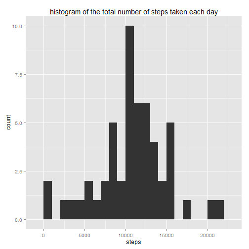
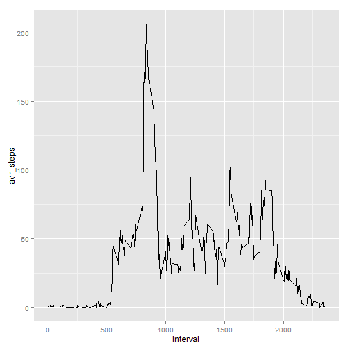
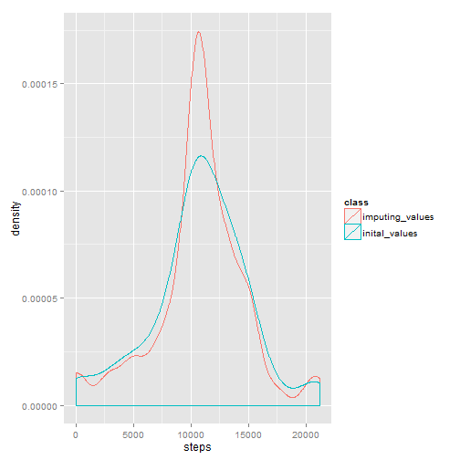
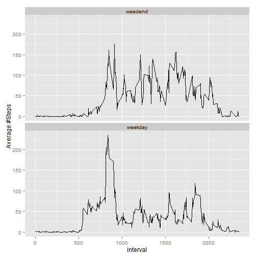
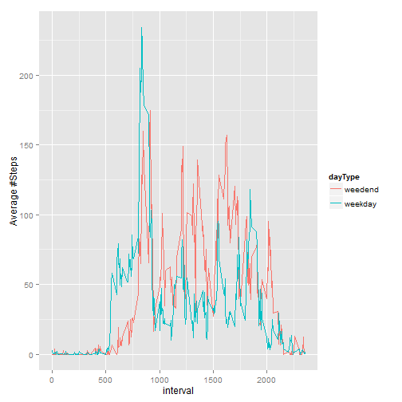

Setting knit

```r
require(knitr)
opts_chunk$set(echo = TRUE, cache = TRUE, cache.path = "cache/", fig.path = "figure/")
```
## Loading and preprocessing the data

```r
#loading libraries
library(ggplot2)
library(dplyr)
```

```
## 
## Attaching package: 'dplyr'
## 
## The following objects are masked from 'package:stats':
## 
##     filter, lag
## 
## The following objects are masked from 'package:base':
## 
##     intersect, setdiff, setequal, union
```

```r
#reading file
activity.raw = read.csv("data_files/activity.csv",stringsAsFactors = FALSE)
#removeing rows without steps data (NA)
activity = filter(activity.raw,!is.na(steps))
```


## What is mean total number of steps taken per day?

```r
#Calculate the total number of steps taken per day    
daily_steps = group_by(activity,date) %>% summarise(steps = sum(steps))    
#Make a histogram of the total number of steps taken each day
ggplot(daily_steps,aes(steps)) +geom_histogram(binwidth=1000) +ggtitle("histogram of the total number of steps taken each day")
```

 

```r
#Calculate and report the mean and median of the total number of steps taken per day
mean_steps = round(mean(daily_steps$steps),2)
median_steps = round(median(daily_steps$steps),2)
```
The mean steps per day is ``1.076619 &times; 10<sup>4</sup>`` and the median is ``1.0765 &times; 10<sup>4</sup>``

## What is the average daily activity pattern?

```r
#Make a time series plot of the 5-minute interval (x-axis) and the average number of steps taken, averaged across all days (y-axis)
interval_series = group_by(activity,interval) %>% summarise(avr_steps = mean(steps))
#plot the intervals
ggplot(interval_series,aes(interval,avr_steps))+geom_line()
```

 

```r
#Which 5-minute interval, on average across all the days in the dataset, contains the maximum number of steps?
arrange(interval_series,desc(avr_steps))[1,]
```

```
## Source: local data frame [1 x 2]
## 
##   interval avr_steps
## 1      835  206.1698
```
## Imputing missing values

```r
#Calculate and report the total number of missing values in the dataset (i.e. the total number of rows with NAs)
na.rows.tbl = filter(activity.raw,is.na(steps))
```
 The total number of missing values in the dataset is ``2304``
#### Devise a strategy for filling in all of the missing values in the dataset. The strategy does not need to be sophisticated. For example, you could use the mean/median for that day, or the mean for that 5-minute interval, etc and Create a new dataset that is equal to the original dataset but with the missing data filled in

```r
#Set the NA to be the average value of that interval
#make a copy of the raw data
activity.na.filled = activity.raw
#join for each entry the mean steps of that interval
activity.na.filled = left_join(activity.na.filled,interval_series)
```

```
## Joining by: "interval"
```

```r
#set the NA steps to be equal to the mean (rounded to nearest int)
na.rows = which(is.na(activity.na.filled$steps))
activity.na.filled[na.rows,]$steps = round(activity.na.filled[na.rows,]$avr_steps,0)
```
Histogram of the total number of steps taken each day

```r
daily_steps_filled = group_by(activity.na.filled,date) %>% summarise(steps = sum(steps))
ggplot(daily_steps_filled,aes(x=steps)) + geom_histogram(binwidth=1000)
```

 

```r
filled_mean_steps = round(mean(daily_steps_filled$steps),2)
filled_median_steps = round(median(daily_steps_filled$steps),2)
```
The mean steps per day is ``1.076619 &times; 10<sup>4</sup>`` and the median is ``1.0765 &times; 10<sup>4</sup>``

The impact of imputing missing data on the estimates of the total daily number of steps is narrowing #stpes per day distribution:

```r
daily_steps$class = "inital_values"
daily_steps_filled$class = "imputing_values"
effect_steps = rbind(daily_steps,daily_steps_filled)
ggplot(effect_steps,aes(x=steps,col=class)) +geom_density()
```

 

## Are there differences in activity patterns between weekdays and weekends?


```r
#Working again with the data without the missing values
#Creating factor variable for the datTYpe(weedend\weekday)
activity$date = as.Date(activity$date)
activity$day = weekdays(activity$date)
activity$dayType = "weekday"
activity[which(activity$day ==  "Saturday" | activity$day ==  "Sunday"),]$dayType = "weedend"
weekday_pattern = group_by(activity,interval,dayType) %>% summarise(total_steps = mean(steps))
ggplot(weekday_pattern,aes(x=interval,y=total_steps)) + geom_line() +facet_wrap(~dayType,ncol=1) +ylab("Average #Steps")
```

 

```r
ggplot(weekday_pattern,aes(x=interval,y=total_steps,color=dayType)) + geom_line() +ylab("Average #Steps")
```

 
